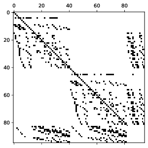

# Navier-Stokes equation -- cavity flow

- flow in a cavity, singular system

$`
\begin{pmatrix}
A & B \\
B^T & 0
\end{pmatrix}
\qquad \Rightarrow \qquad`$


- solving singular system with nontrivial null space
- other options - Lagrange multipliers

# Boussinesq approximation

- reproduce the [Rayleigh-Bernard convection problem](https://doi.org/10.1016/j.crme.2008.02.004)

solve the following nondimensional system:

$$
\begin{aligned}                                                                                                                     
\mathrm{\partial \vec{v}}{\partial t} + ( \nabla \vec{v} ) \vec{v}                                                                   
-\mathrm{div}\left(\mathbf{T}\right) + \nabla p &= e \vec{g} \quad\text{ in }\Omega, \\
\frac{\partial e}{\partial t} + \nabla e \cdot \vec{v}                                                                   
-\mathrm{div}\left(\frac{1}{\sqrt{\mathrm{Pr}\mathrm{Ra}}} \nabla e\right) + \mathbf{T}:\mathbf{D} &= 0 \quad\text{ in }\Omega, \\                                           
\mathrm{div} \vec{v} &= 0 \quad\text{ in }\Omega, \\                                                                          
\end{aligned}
$$

where $`\mathbf{D}=\frac12 (\nabla\vec{v} + \nabla\vec{v}^T)`$ and $`\mathbf{T}=\left(\frac{\mathrm{Pr}}{\mathrm{Ra}}\right)^{\frac12}\mathbf{D}`$ 


File `nse_solver.py` solves the nonstationary version of the equation on given mesh and given mixed finite element.


# Multiphase flow with levelset method 

- [Rising bubble benchmark](https://www.mathematik.tu-dortmund.de/~featflow/en/benchmarks/cfdbenchmarking/bubble/bubble_configurations.html)
- [Level set method](https://en.wikipedia.org/wiki/Level-set_method)
- some more ideas... [An improved interface preserving level set method for simulating three dimensional rising bubble](https://doi.org/10.1016/j.ijheatmasstransfer.2016.07.096)

```math
\begin{aligned}                                                                                                                     
\varrho \frac{\partial \vec{v}}{\partial t} + \varrho ( \nabla \vec{v} ) \vec{v}                                                                   
-\mathrm{div}\left(\mathbf{T}\right) + \nabla p &= \varrho \vec{g} \quad\text{ in }\Omega, \\
\frac{\partial \phi}{\partial t} + \nabla \phi \cdot \vec{v}  &= 0 \quad\text{ in }\Omega, \\                                           
\mathrm{div} \vec{v} &= 0 \quad\text{ in }\Omega, \\                                                                          
\end{aligned}
```

where $`\mathbf{D}=\frac12 (\nabla\vec{v} + \nabla\vec{v}^T)`$ and $`\mathbf{T}= 2 \mu \mathbf{D}`$ 


See file `rising_bubble.py`.
